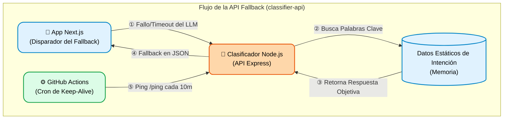

# chat-rag-personal-classifier-api


Una API ligera y de alto rendimiento en Node.js y TypeScript diseñada para clasificar textos en lenguaje natural en categorías predefinidas. Optimizada para plataformas de mensajería (Chatbots, WhatsApp), utiliza un algoritmo personalizado de coincidencia de palabras clave con pesos para proporcionar respuestas de latencia ultrabaja sin depender de LLMs externos pesados.

---

## 🚀 Características

* **Soporte Multi-Idioma**: Soporte completo para `pt-BR`, `en-US` y `es-LA`.
* **Clasificación Inteligente**: Utiliza coocurrencia de palabras clave con pesos para categorizar texto en 9 dominios distintos (resumen, experiencia, habilidades, etc.).
* **Respuestas Dinámicas**: Selecciona aleatoriamente respuestas variadas dentro de la categoría correspondiente para simular una conversación natural.
* **Baja Latencia**: Construida para velocidad, ideal para webhooks síncronos de chatbots.
* **Lista para Docker**: Totalmente en contenedores para fácil implementación y escalabilidad.
* **Cliente CLI Integrado**: Incluye un cliente de chat vía terminal para pruebas locales rápidas.

---

## 🛠 Arquitectura & Tech Stack

* **Runtime**: Node.js
* **Lenguaje**: TypeScript
* **Framework**: Express.js
* **Contenedores**: Docker & Docker Compose
* **Patrón de Arquitectura**: Capas Controller-Service-Router

### 🏗️ Arquitectura Empresarial (Modelo C4)

Este servicio actúa como una capa de fallback ultrarrápida y resiliente cuando los LLMs externos no están disponibles, manteniendo el portafolio receptivo en todo momento.



---

## 📦 Empezando

### Requisitos previos

Asegúrate de tener lo siguiente instalado en tu máquina:
* [Node.js](https://nodejs.org/en/) (v20 o superior)
* [Docker](https://www.docker.com/) y Docker Compose

### Instalación

Clona el repositorio e instala las dependencias:

```bash
git clone <tu-url-del-repositorio>
cd chat-rag-personal-classifier-api
npm install
```

### Ejecutando con Docker (Recomendado)

Para iniciar la aplicación en un entorno aislado y en contenedores:

```bash
docker-compose up -d --build
```

La API estará disponible en `http://localhost:3000`.

### Ejecutando Localmente (Modo de Desarrollo)

Para ejecutar la API directamente en tu máquina con recarga en caliente (hot-reloading):

```bash
npm run dev
```

---

## 📖 Referencia de la API

**URL de Producción:** `https://api.maioli.dev.br/chat-rag-personal-classifier-api`

### Clasificar Texto

Clasifica un mensaje entrante y devuelve una respuesta contextualizada.

**Endpoint:** `POST /chat-rag-personal-classifier-api`

**Headers:**

* `Content-Type: application/json`

**Cuerpo de la Solicitud:**

```json
{
  "text": "skill",
  "locale": "en-US"
}
```

**Respuesta Exitosa (200 OK):**

```json
{
  "locale": "pt-BR",
  "intent": "skills",
  "response": "Minhas principais ferramentas incluem Node.js, TypeScript e bancos de dados relacionais."
}
```

**Respuesta de Error (400 Bad Request):**

```json
{
  "error": "Bad Request",
  "message": "The provided locale is not supported. Use pt-BR, en-US, or es-LA."
}
```

---

## 💻 Probando la API

Proporcionamos dos formas de probar la aplicación nativamente.

### 1. Cliente CLI Interactivo

Puedes ejecutar una interfaz de chat interactiva directamente en tu terminal para simular a un usuario chateando con el bot. El código interno utiliza llamadas nativas de Node.js.

```bash
npm run client
```

**Ejemplo de Código (`src/cli-client.ts` integración):**

```typescript
// Buscar datos de la API local
const fetchOptions = {
  method: 'POST',
  headers: {
    'Content-Type': 'application/json'
  },
  body: JSON.stringify({
    text: userMessage,
    locale: testingLanguage
  })
}

const networkResponse = await fetch(localApiUrl, fetchOptions)
const responseData = await networkResponse.json()
```

### 2. Cliente HTTP REST

Si tu IDE soporta archivos `.http` (como REST Client en VS Code), abre el archivo `api-tests.http` en la raíz del proyecto y haz clic en `Send Request` para disparar payloads predefinidos.

---

## 📂 Estructura del Proyecto

```text
chat-rag-personal-classifier-api/
├── src/
│   ├── index.ts                     # Punto de entrada de la aplicación
│   ├── cli-client.ts                # Cliente de chat interactivo de terminal
│   ├── types/
│   │   └── index.ts                 # Interfaces y tipos globales de TypeScript
│   ├── data/
│   │   └── responses.ts             # Base de respuestas categorizadas del bot
│   ├── services/
│   │   └── classifierService.ts     # Algoritmo principal para análisis de texto
│   ├── controllers/
│   │   └── classifierController.ts  # Validación de peticiones y respuestas HTTP
│   └── routes/
│       └── classifierRoutes.ts      # Definiciones de rutas de Express
├── Dockerfile                       # Proyecto de la imagen Docker
├── docker-compose.yml               # Orquestación de servicios Docker
├── api-tests.http                   # Suite de pruebas del Cliente REST
├── test-all.js                      # Script para probar todas las intenciones y locales
├── package.json
└── tsconfig.json
```

---

## 📝 Estándares de Código

Este proyecto sigue estrictas pautas de código:

* Comillas simples (`'`) para todas las cadenas en JavaScript/TypeScript.
* Sin punto y coma (`;`) al final de las declaraciones.
* Nombres de variables altamente descriptivos (sin variables de una letra).
* Los comentarios del código deben estar exclusivamente en `en-US`.

---

## 🤝 Contribuyendo

¡Las contribuciones son bienvenidas! Por favor, sigue estos pasos:

1. Haz un Fork del proyecto.
2. Crea tu rama de característica (`git checkout -b feature/CaracteristicaIncreible`).
3. Confirma tus cambios (`git commit -m 'Agregar CaracteristicaIncreible'`).
4. Haz Push a la rama (`git push origin feature/CaracteristicaIncreible`).
5. Abre un Pull Request.

---

## 📄 Licencia

Distribuido bajo la Licencia MIT. Consulta `LICENSE` para más información.
