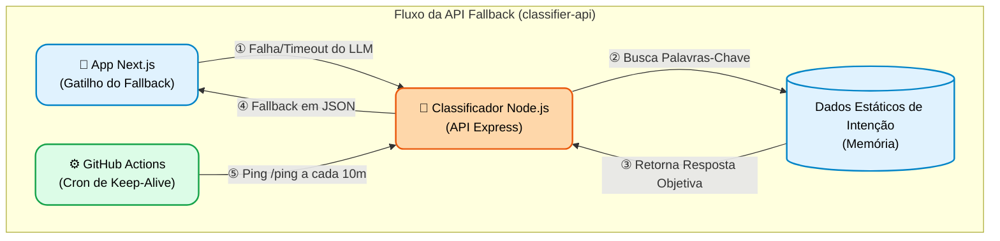

# chat-rag-personal-classifier-api


Uma API leve e de alta performance em Node.js e TypeScript projetada para classificar textos em linguagem natural em categorias predefinidas. Otimizada para plataformas de mensagens (Chatbots, WhatsApp), utiliza um algoritmo customizado de correspondência de palavras-chave com pesos para fornecer respostas de latência ultrabaixa sem depender de LLMs externos pesados.

---

## 🚀 Funcionalidades

* **Suporte Multi-Idioma**: Suporte completo a `pt-BR`, `en-US` e `es-LA`.
* **Classificação Inteligente**: Utiliza coocorrência de palavras-chave com pesos para categorizar textos em 9 domínios distintos (resumo, experiência, habilidades, etc.).
* **Respostas Dinâmicas**: Seleciona aleatoriamente respostas variadas dentro da categoria correspondente para simular uma conversa natural.
* **Baixa Latência**: Construída para velocidade, sendo ideal para webhooks síncronos de chatbots.
* **Pronta para Docker**: Totalmente conteinerizada para fácil implantação e escalabilidade.
* **Cliente CLI Embutido**: Inclui um cliente de chat via terminal para testes locais rápidos.

---

## 🛠 Arquitetura & Stack Tecnológica

* **Runtime**: Node.js
* **Linguagem**: TypeScript
* **Framework**: Express.js
* **Conteinerização**: Docker & Docker Compose
* **Padrão de Arquitetura**: Camadas Controller-Service-Router

### ⚡ Prevenção de Cold Start & CI/CD

Como parte de uma estratégia otimizada de FinOps (controle de custos), esta aplicação é implantada em instâncias serverless/efêmeras que hibernam (scale to zero) durante períodos de inatividade. Embora financeiramente eficiente, isso introduz a latência de 'Cold Start' na primeira requisição.
Para contornar essa limitação e garantir uma Experiência do Usuário (UX) imediata e fluida, um pipeline automatizado de CI/CD utilizando GitHub Actions (Cron Jobs) foi arquitetado. Este sistema orquestra requisições de 'ping' direcionadas aos endpoints a cada 10 minutos, mantendo as instâncias 'aquecidas' e contornando o tempo limite de ociosidade do provedor. Esta abordagem demonstra um domínio prático sobre as restrições de infraestrutura em nuvem através de automação direcionada.

### 🏗️ Arquitetura Corporativa (C4 Model)

Este serviço atua como uma camada de fallback ultra-rápida e resiliente quando os LLMs externos estão indisponíveis, mantendo o portfólio responsivo em todos os momentos.

**Design for Resilience & FinOps:** Este serviço atua como uma rede de segurança (fallback) contra quedas da API de LLM (HTTP 429) e estouro de limite de tokens, garantindo 'zero-downtime' e uma experiência ininterrupta. Ao servir respostas NLG pré-processadas, ele controla rigorosamente os custos e garante alta disponibilidade, mesmo sob picos de carga inesperados.

> **Nota de Roadmap:** No futuro (quando o chat livre for ativado no lado do cliente), esta API evoluirá para atuar como um **Intent Router**. Ela filtrará requisições recebidas para decidir de forma inteligente se aciona uma busca vetorial cara (True RAG) ou se serve uma resposta rápida e estática (NLG), otimizando tanto a latência quanto os recursos financeiros.



---

## 📦 Começando

### Pré-requisitos

Certifique-se de ter os seguintes itens instalados na sua máquina:
* [Node.js](https://nodejs.org/en/) (v20 ou superior)
* [Docker](https://www.docker.com/) e Docker Compose

### Instalação

Clone o repositório e instale as dependências:

```bash
git clone <seu-link-do-repositorio>
cd chat-rag-personal-classifier-api
npm install
```

### Executando com Docker (Recomendado)

Para iniciar a aplicação em um ambiente isolado e conteinerizado:

```bash
docker-compose up -d --build
```

A API estará disponível em `http://localhost:3000`.

### Executando Localmente (Modo de Desenvolvimento)

Para executar a API diretamente na sua máquina com recarregamento automático (hot-reload):

```bash
npm run dev
```

---

## 📖 Referência da API

**URL de Produção:** `https://api.maioli.dev.br/chat-rag-personal-classifier-api`

### Classificar Texto

Classifica uma mensagem de entrada e retorna uma resposta contextualizada.

**Endpoint:** `POST /chat-rag-personal-classifier-api`

**Headers:**

* `Content-Type: application/json`

**Corpo da Requisição:**

```json
{
  "text": "skill",
  "locale": "en-US"
}
```

**Resposta de Sucesso (200 OK):**

```json
{
  "locale": "pt-BR",
  "intent": "skills",
  "response": "Minhas principais ferramentas incluem Node.js, TypeScript e bancos de dados relacionais."
}
```

**Resposta de Erro (400 Bad Request):**

```json
{
  "error": "Bad Request",
  "message": "The provided locale is not supported. Use pt-BR, en-US, or es-LA."
}
```

---

## 💻 Testando a API

Nós fornecemos duas maneiras de testar a aplicação nativamente.

### 1. Cliente CLI Interativo

Você pode executar uma interface de chat interativa diretamente no seu terminal para simular um usuário conversando com o bot. O código interno utiliza chamadas nativas do Node.js.

```bash
npm run client
```

**Exemplo de Código (`src/cli-client.ts` integração):**

```typescript
// Buscar dados da API local
const fetchOptions = {
  method: 'POST',
  headers: {
    'Content-Type': 'application/json'
  },
  body: JSON.stringify({
    text: userMessage,
    locale: testingLanguage
  })
}

const networkResponse = await fetch(localApiUrl, fetchOptions)
const responseData = await networkResponse.json()
```

### 2. Cliente HTTP REST

Se a sua IDE suporta arquivos `.http` (como o REST Client no VS Code), abra o arquivo `api-tests.http` na raiz do projeto e clique em `Send Request` para disparar payloads predefinidos.

---

## 📂 Estrutura do Projeto

```text
chat-rag-personal-classifier-api/
├── src/
│   ├── index.ts                     # Ponto de entrada da aplicação
│   ├── cli-client.ts                # Cliente de chat interativo de terminal
│   ├── types/
│   │   └── index.ts                 # Interfaces e tipos globais TypeScript
│   ├── data/
│   │   └── responses.ts             # Banco de respostas categorizadas do bot
│   ├── services/
│   │   └── classifierService.ts     # Algoritmo principal para análise de texto
│   ├── controllers/
│   │   └── classifierController.ts  # Validação de requisições e respostas HTTP
│   └── routes/
│       └── classifierRoutes.ts      # Definições de rotas do Express
├── Dockerfile                       # Projeto da imagem Docker
├── docker-compose.yml               # Orquestração dos serviços Docker
├── api-tests.http                   # Suíte de testes do Cliente REST
├── test-all.js                      # Script para testar todas as intenções e locais
├── package.json
└── tsconfig.json
```

---

## 📝 Padrões de Código

Este projeto segue diretrizes de código estritas:

* Aspas simples (`'`) para todas as strings em JavaScript/TypeScript.
* Sem ponto e vírgula (`;`) no final das instruções.
* Nomes de variáveis altamente descritivos (sem variáveis de uma letra).
* Comentários de código devem ser exclusivamente em `en-US`.

---

## 🤝 Contribuindo

Contribuições são bem-vindas! Siga os passos:

1. Faça um Fork do projeto.
2. Crie sua branch de funcionalidade (`git checkout -b feature/FuncionalidadeIncrivel`).
3. Faça o Commit das alterações (`git commit -m 'Adicionar FuncionalidadeIncrivel'`).
4. Faça o Push para a branch (`git push origin feature/FuncionalidadeIncrivel`).
5. Abra um Pull Request.

---

## 📄 Licença

Distribuído sob a licença MIT. Consulte `LICENSE` para obter mais informações.
